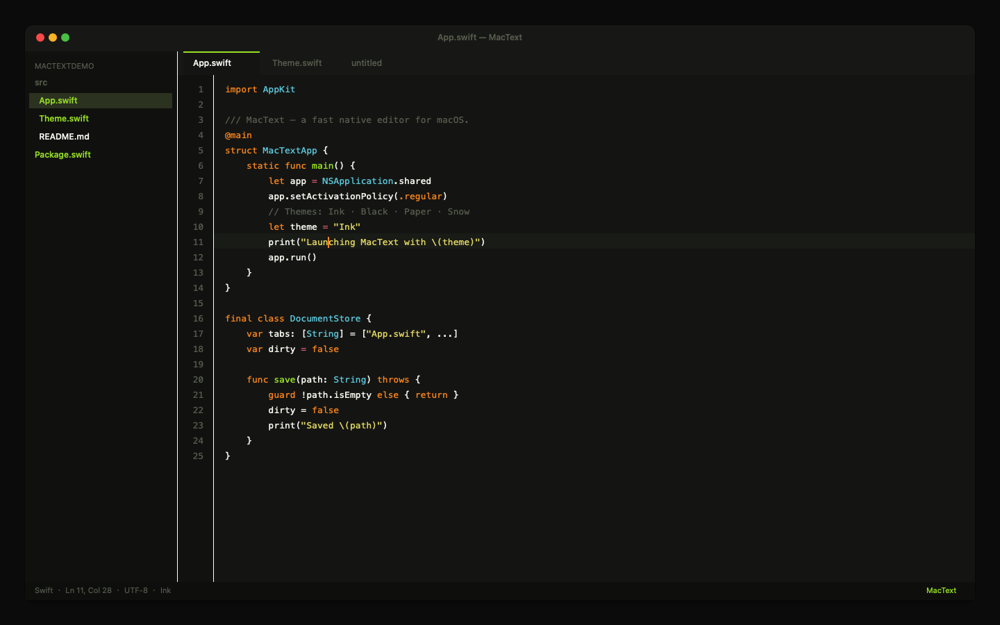

<p align="center">
  
</p>

<h1 align="center">MacText</h1>

<p align="center">
  <strong>Native macOS text editor</strong> — Sublime-like core, AppKit performance.<br/>
  Multi-tab · Sidebar · Find/Replace · Indent · Command Palette · Syntax Highlight · Session Restore
</p>

<p align="center">
  <a href="https://github.com/linux503/MacText/releases/latest"></a>
  <a href="https://github.com/linux503/MacText/releases"></a>
  <a href="https://github.com/linux503/MacText/releases"></a>
  <a href="https://linux503.github.io/MacText/"></a>
</p>

<p align="center">
  <a href="https://github.com/linux503/MacText/releases/download/v1.1.3/MacText-1.1.3.dmg"><strong>Download DMG</strong></a>
  ·
  <a href="https://linux503.github.io/MacText/">Website</a>
  ·
  <a href="https://github.com/linux503/MacText/releases">Releases</a>
</p>

---

<p align="center">
  
</p>

## Highlights

| | |
|---|---|
| **Editing** | Multi-tab open / save / save-as / close, dirty-file prompts, line numbers, multi-line indent |
| **Navigation** | Folder sidebar (⌘B), go-to-line, command palette (⌘⇧P) |
| **Search** | Find & replace with next / previous match |
| **Appearance** | Themes: **Ink** · **Black** · **Paper** · **Snow** |
| **Languages** | Swift, Python, JavaScript / TypeScript, JSON, Markdown |
| **Session** | Restores tabs, unsaved text, caret, folder, theme, window frame |

Built with native **AppKit** — no Electron. Ships as a **Universal Binary** (`arm64` + `x86_64`).

## Install

1. Download [`MacText-1.1.3.dmg`](https://github.com/linux503/MacText/releases/download/v1.1.3/MacText-1.1.3.dmg)
2. Drag **MacText** into **Applications**
3. If Gatekeeper blocks: **System Settings → Privacy & Security → Open Anyway**

```text
SHA-256  6d3d8e203f8376707c0d739d289ed2428f224d05c73623ba26b1ab7216e2d335
```

## Shortcuts

| Action | Key | Action | Key |
|--------|-----|--------|-----|
| New | ⌘N | Find | ⌘F |
| Open File | ⌘O | Replace | ⌘⌥F |
| Open Folder | ⌘⇧O | Command Palette | ⌘⇧P |
| Save | ⌘S | Go to Line | ⌘⌥G |
| Close Tab | ⌘W | Toggle Sidebar | ⌘B |
| Indent | Tab / ⌘] | Unindent | ⇧Tab / ⌘[ |
| Duplicate Line | ⌘⇧D | Delete Line | ⌃⇧K |
| Select Line | ⌘L | Join Lines | ⌘J |
| Move Line | ⌘⌃↑/↓ | Toggle Comment | ⌘/ |
| Matching Bracket | ⌃M | Auto-Save | on by default |
| Settings | ⌘, | Language | 设置 → 界面语言 |

Theme cycle: **⌘⌥T** · Settings: **⌘,**

## Build from source

Requires macOS 14+ and Swift 5.9+ (Xcode or Command Line Tools).

```bash
chmod +x Scripts/*.sh
./Scripts/release.sh          # icon + Universal .app + DMG → dist/
```

| Script | Purpose |
|--------|---------|
| `Scripts/make_icon.sh` | Generate `AppIcon.icns` |
| `Scripts/build_app.sh` | Assemble Universal `.app` |
| `Scripts/make_dmg.sh` | Package installable DMG |

```bash
swift run                     # debug run
```

Session data lives at `~/Library/Application Support/MacText/session.json`.

## License

Source available on GitHub. Contributions and issues welcome.
