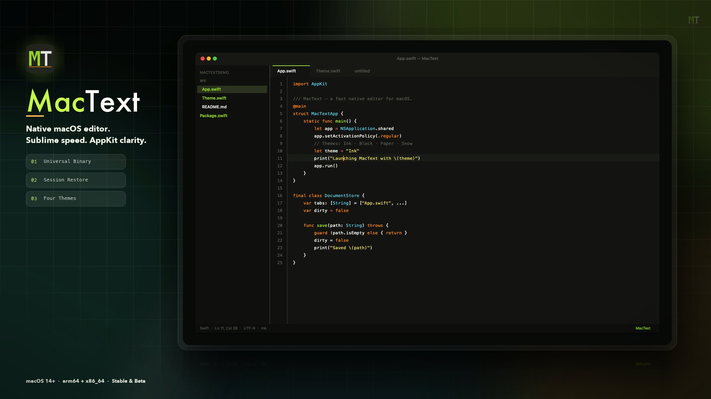
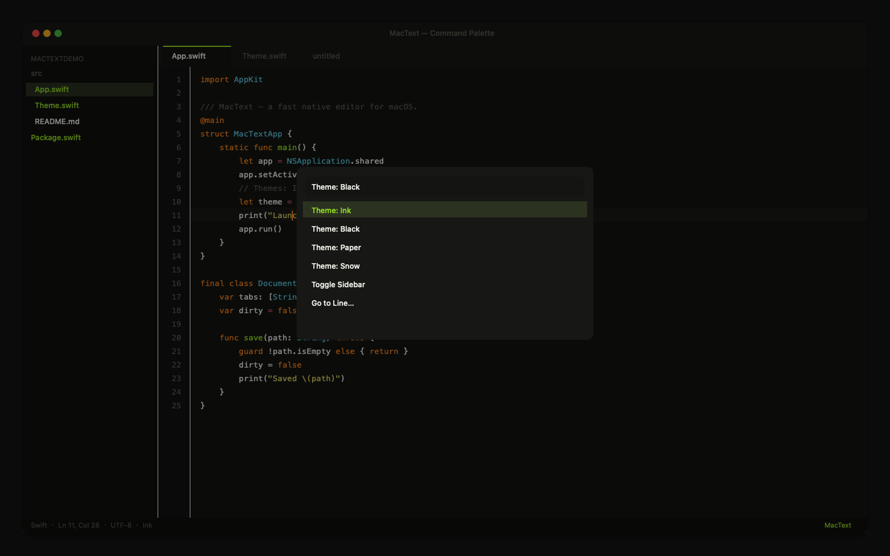
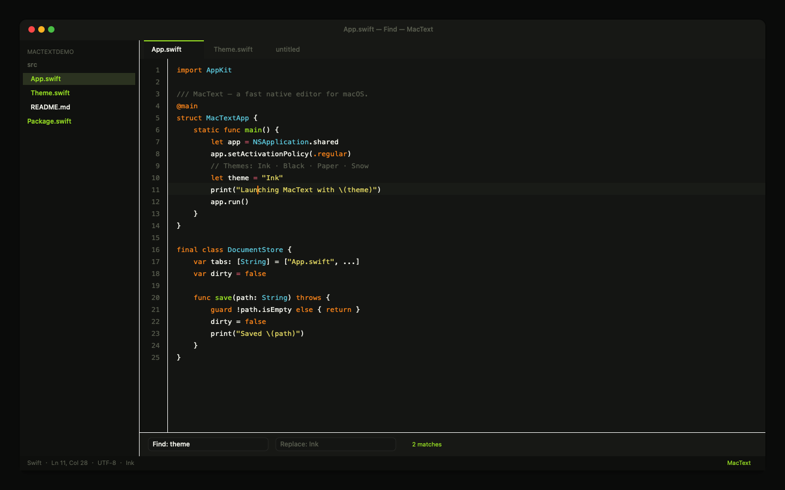

<p align="center">
  
</p>

<h1 align="center">MacText</h1>

<p align="center">
  <strong>Native macOS text editor</strong> — Sublime-like speed, AppKit clarity, zero Electron weight.<br/>
  Multi-tab · Sidebar · Find/Replace · Command Palette · Syntax Highlight · Session Restore
</p>

<p align="center">
  <a href="https://github.com/linux503/MacText/releases/latest"></a>
  <a href="https://github.com/linux503/MacText/releases"></a>
  <a href="https://github.com/linux503/MacText/releases"></a>
  <a href="https://linux503.github.io/MacText/"></a>
  <a href="https://linux503.github.io/MacText/zh/"></a>
</p>

<p align="center">
  <a href="https://github.com/linux503/MacText/releases/download/v1.1.3/MacText-1.1.3.dmg"><strong>Download Stable</strong></a>
  ·
  <a href="https://github.com/linux503/MacText/releases/download/v1.1.4/MacText-1.1.4.dmg"><strong>Try Beta</strong></a>
  ·
  <a href="https://linux503.github.io/MacText/">Website</a>
  ·
  <a href="https://github.com/linux503/MacText/releases">All releases</a>
</p>

---

<p align="center">
  
</p>

## Why MacText

| | |
|---|---|
| **Native** | Pure AppKit — instant launch, low memory, no Electron |
| **Familiar** | Sublime-style editing keys, tabs, sidebar, palette |
| **Persistent** | Quitting keeps unsaved buffers, caret, folder, theme |
| **Bilingual** | Chinese UI by default; switch anytime in Settings |
| **Universal** | One DMG for Apple Silicon and Intel (`arm64` + `x86_64`) |

## Features

| Area | Details |
|------|---------|
| **Editing** | Multi-tab open / save / save-as / close · dirty prompts · line numbers · multi-line indent |
| **Sublime keys** | Duplicate / move / delete / join lines · toggle comment · matching brackets · auto-indent |
| **Navigation** | Folder sidebar (⌘B) · go-to-line · command palette (⌘⇧P) · tear-off tabs |
| **Search** | Inline find & replace · next / previous · Esc to dismiss |
| **Appearance** | Themes: **Ink** · **Black** · **Paper** · **Snow** · font size shortcuts |
| **Languages** | Swift · Python · JavaScript / TypeScript · JSON · Markdown |
| **Session** | Restores tabs, unsaved text, caret, folder, theme, window frame |
| **Auto-save** | Session backup always on; files with a path can write to disk automatically |
| **Updates** | Checks the site `version.json` (Stable channel) without GitHub API rate limits |

## Install

### Channels

| Channel | Version | Who it's for |
|---------|---------|--------------|
| **Stable** | [1.1.3](https://github.com/linux503/MacText/releases/download/v1.1.3/MacText-1.1.3.dmg) | Daily use (recommended) |
| **Beta** | [1.1.4](https://github.com/linux503/MacText/releases/download/v1.1.4/MacText-1.1.4.dmg) | Latest changes, early access |

1. Download the DMG for your channel  
2. Drag **MacText** into **Applications**  
3. If Gatekeeper blocks: **System Settings → Privacy & Security → Open Anyway**

```text
Stable SHA-256  6d3d8e203f8376707c0d739d289ed2428f224d05c73623ba26b1ab7216e2d335
Beta SHA-256    1716e24b50b8a7852ec1cf2eb3210d810ebaaf379bf6e6267e4a801c6e050663
```

**Release model:** each new ship promotes the previous Beta → Stable, and the newest build becomes Beta. Source of truth: [`docs/version.json`](docs/version.json).

## Shortcuts

| Action | Key | Action | Key |
|--------|-----|--------|-----|
| New | ⌘N | Find | ⌘F |
| Open File | ⌘O | Replace | ⌘⌥F |
| Open Folder | ⌘⇧O | Command Palette | ⌘⇧P |
| Save | ⌘S | Go to Line | ⌘⌥G |
| Close Tab | ⌘W | Toggle Sidebar | ⌘B |
| Indent | Tab / ⌘] | Unindent | ⇧Tab / ⌘[ |
| Duplicate Line | ⌘⇧D | Delete Line | ⌃⇧K |
| Select Line | ⌘L | Join Lines | ⌘J |
| Move Line | ⌘⌃↑/↓ | Toggle Comment | ⌘/ |
| Matching Bracket | ⌃M | Cycle Theme | ⌘⌥T |
| Bigger / Smaller Font | ⌘+ / ⌘− | Settings | ⌘, |

UI language: **Settings (⌘,) → 界面语言**.

## Screenshots

<p align="center">
  
</p>

<p align="center">
  
  &nbsp;
  
</p>

## Website

- English: https://linux503.github.io/MacText/  
- 中文: https://linux503.github.io/MacText/zh/  

The site lists **Stable** and **Beta** downloads side by side and reads channels from `version.json`.

## Build from source

Requires **macOS 14+** and **Swift 5.9+** (Xcode or Command Line Tools).

```bash
chmod +x Scripts/*.sh
./Scripts/release.sh          # icon + Universal .app + DMG → dist/
```

| Script | Purpose |
|--------|---------|
| `Scripts/make_icon.sh` | Generate `AppIcon.icns` from `assets/MacTextIcon-flat.png` |
| `Scripts/build_app.sh` | Assemble Universal `.app` (arm64 + x86_64) |
| `Scripts/make_dmg.sh` | Package installable DMG + SHA-256 |
| `Scripts/bump_site_channels.sh` | Promote Beta → Stable, set new Beta in `docs/version.json` |

```bash
swift run                     # debug run from source
```

### Session data

```text
~/Library/Application Support/MacText/session.json
```

Buffers, selection, folder, theme, and window frame are restored on next launch.

### Project layout

```text
Sources/MacText/     AppKit editor source
Resources/           Info.plist, AppIcon.icns
Scripts/             Build & release helpers
docs/                GitHub Pages site (EN + ZH)
assets/              Master logo art
```

## Roadmap ideas

- More language highlighters  
- Project-wide search  
- Optional iCloud / folder watch  

Issues and PRs welcome.

## License

Source available on GitHub. Use, fork, and contribute freely unless a more specific license file is added later.
